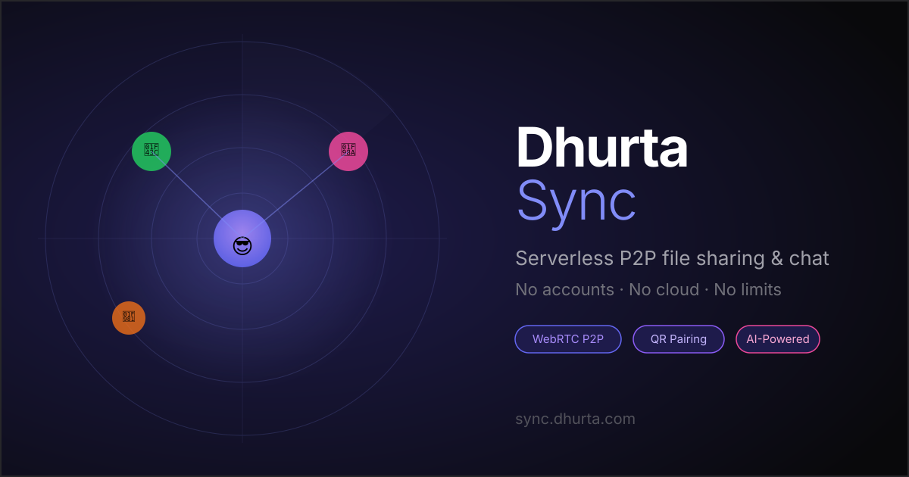

<div align="center">



<br/>

# ⚡ Dhurta Sync

### Serverless · Peer-to-Peer · AI-Powered

**Share files, chat, and call — directly between any devices.**  
No servers. No accounts. No file size limits. No cloud.

<br/>

[](https://sync.dhurta.com)
[](https://github.com/prashantkeshr/Dhurta-Sync)
[](https://sync.dhurta.com)
[](https://webrtc.org)
[](https://developer.chrome.com/docs/ai)

</div>

---

## 🎯 What is Dhurta Sync?

Dhurta Sync is a **zero-backend, open-source web application** that lets any two devices share files, send encrypted messages, and make voice/video calls — all through a direct peer-to-peer connection in the browser.

> Think AirDrop + WhatsApp + ShareIt — but for **every** device, every OS, every browser, with **no installation** required.

---

## ✨ Features

| Feature | Description |
|--------|-------------|
| 🛰️ **Transfer Mode** | Radar UI showing nearby peers. Drag-and-drop files to send at full WebRTC speed (~10 MB/s+) |
| ⚡ **Beam Mode** | ShareMe/Xender-style glowing orb. Tap → pick file → watch progress ring → receive in grid |
| 💬 **Chat Mode** | WhatsApp-style encrypted group chat with typing indicators, avatars & colour coding |
| 📹 **Video & Voice Calls** | WebRTC-powered peer-to-peer calls with mute/camera toggle and screen sharing |
| 🤖 **AI Assistant** | Chrome Gemini Nano (built-in AI) for smart file tips and in-chat AI replies |
| 📱 **QR Code Pairing** | Scan a QR code to instantly join another device's room |
| 🔢 **PIN Room Join** | Type the same 4-digit PIN on both devices — no Bluetooth, no NFC |
| 🔒 **End-to-End Encrypted** | WebRTC DTLS transport encryption on every transfer |
| 📦 **No File Size Limit** | Files stream as binary chunks — no upload cap ever |
| 🌐 **Works Offline** | PWA with cache-first service worker. Loads after first visit even without internet |
| 🎨 **Ambient UI** | Point-light follows your cursor. Dark glass aesthetic with premium animations |

---

## 🚀 Quick Start

### Open in browser (no install needed)

```
https://sync.dhurta.com
```

### Connect two devices

**Option A — QR Code**
1. Open the app on Device A → tap the **QR icon** in the nav → copy shows your QR
2. Open the app on Device B → tap **Scan** → point camera at Device A's QR
3. Both devices are now in the same room ✅

**Option B — 4-digit PIN**
1. Note the PIN shown in the top-right of Device A (e.g. `1080`)
2. On Device B, type that PIN in the dock input field → press **→**
3. Both devices are now in the same room ✅

### Send a file

- **Transfer mode** → Drag a file onto the radar, or tap the upload icon in the dock
- **Beam mode** → Tap the glowing indigo orb → pick file → sent instantly

---

## 🏗️ Architecture

```
┌─────────────┐   MQTT WebSocket   ┌─────────────┐
│  Device A   │ ◄─────────────────► │  Device B   │
│  (Browser)  │                     │  (Browser)  │
│             │   WebRTC DataChan   │             │
│             │ ◄═════════════════► │             │
└─────────────┘   (binary chunks)   └─────────────┘
       │                                   │
       └──────── STUN (Google) ────────────┘
                (NAT traversal only)
```

### Signalling layer — MQTT mesh
Three public MQTT brokers in failover order:
```
wss://broker.emqx.io:8084/mqtt     (primary)
wss://broker.hivemq.com:8884/mqtt  (fallback 1)
wss://test.mosquitto.org:8081      (fallback 2)
```
Topic: `dhurta_mesh_v10/room_{PIN}`

### Transport layer — WebRTC DataChannel
- SCTP DataChannels with `ordered: true`
- 64 KB binary chunks with 512 KB backpressure control
- DTLS encryption end-to-end
- STUN: `stun:stun.l.google.com:19302`

### AI layer — Chrome built-in AI
- Uses `window.ai.languageModel` (Gemini Nano, Chrome 127+)
- No API key, no external call, runs fully on-device
- Falls back gracefully on unsupported browsers

---

## 🗂️ File Structure

```
Dhurta-Sync/
├── index.html      — App shell + full SEO head (OG, JSON-LD, Twitter Card)
├── style.css       — Premium dark UI, animations, responsive layout
├── app.js          — P2P engine (MQTT, WebRTC, QR, AI, chat, transfers)
├── sw.js           — Cache-first service worker (dhurta-v5)
├── manifest.json   — PWA manifest with shortcuts and share_target
├── robots.txt      — Search engine + AI crawler rules
├── sitemap.xml     — URL map with image tags for Google
├── llms.txt        — AI/LLM discoverability descriptor
├── og-image.svg    — 1200×630 social preview card
└── CNAME           — sync.dhurta.com (GitHub Pages custom domain)
```

---

## 🤖 AI Features

Dhurta Sync integrates **Chrome's built-in Gemini Nano** (Prompt API) for on-device AI — no API key, no external server, no privacy concern.

### Available AI commands

| Trigger | What it does |
|---------|-------------|
| `/ai <question>` in chat | Gets an AI answer displayed in the chat |
| `/ask <question>` in chat | Same as `/ai` |
| Sending any file | Smart toast shows file category icon + size + estimated transfer time |
| Sending file > 10 MB | AI gives a one-sentence transfer optimization tip |

### Compatibility
- ✅ **Chrome 127+** on desktop with Gemini Nano downloaded — full AI features
- ✅ **All other browsers** — app works normally, AI features silently skipped

---

## 📡 Modes

### 🛰️ Transfer Mode
Radar canvas showing all peers in the same PIN room as orbiting dots. Click a peer to select them, then drag-drop a file or use the dock uploader.

### ⚡ Beam Mode
ShareMe-style one-tap send. A pulsing indigo orb is the send button — tap it to pick a file. Received files appear in a thumbnail grid below with download buttons.

### 💬 Chat Mode
Persistent room chat over MQTT + DataChannel with message deduplication, typing indicators, per-device colour avatars, and AI assistant support.

---

## 🛠️ Local Development

This is a pure static site — no build step, no Node.js required.

```bash
# Clone
git clone https://github.com/prashantkeshr/Dhurta-Sync.git
cd Dhurta-Sync

# Serve locally (any static server works)
npx serve .
# or
python -m http.server 8080
# or
npx live-server
```

Open `http://localhost:8080` in two browser tabs (or two devices on the same network) and enter the same PIN to test P2P.

---

## 🔍 SEO & Discoverability

| Signal | File | Status |
|--------|------|--------|
| Meta description + keywords | `index.html` | ✅ |
| Open Graph (Facebook/LinkedIn) | `index.html` | ✅ |
| Twitter/X Card | `index.html` | ✅ |
| JSON-LD structured data | `index.html` | ✅ WebApplication + FAQPage |
| Canonical URL | `index.html` | ✅ |
| Robots.txt (AI crawlers allowed) | `robots.txt` | ✅ |
| XML Sitemap with image tags | `sitemap.xml` | ✅ |
| llms.txt (AI tool descriptor) | `llms.txt` | ✅ |
| PWA manifest with categories | `manifest.json` | ✅ |
| Social preview image | `og-image.svg` | ✅ 1200×630 |

---

## 🔒 Privacy & Security

- **No data ever leaves your device** via our servers — we don't have any
- Files transfer directly peer-to-peer via WebRTC DTLS (encrypted transport)
- MQTT brokers see only signalling messages (offer/answer/ICE), never file data
- No cookies, no analytics, no tracking
- No account or personal information required

---

## 🗺️ Roadmap

- [ ] LAN-direct mode (WebRTC without STUN for same-network peers)
- [ ] Folder transfer support (zip on-the-fly)
- [ ] Persistent chat history (IndexedDB)
- [ ] Multi-room support
- [ ] Custom MQTT broker configuration
- [ ] AI-powered file previews and summaries

---

## 🙏 Credits & Tech Stack

| Layer | Technology |
|-------|-----------|
| P2P Transport | [WebRTC](https://webrtc.org) DataChannels (SCTP) |
| Signalling | [MQTT.js](https://github.com/mqttjs/MQTT.js) over WebSocket |
| QR Scanning | [jsQR](https://github.com/cozmo/jsQR) |
| QR Generation | Custom Reed-Solomon GF(256) encoder (pure JS) |
| AI | [Chrome Prompt API](https://developer.chrome.com/docs/ai/built-in) — Gemini Nano |
| Hosting | [GitHub Pages](https://pages.github.com) |
| Domain | [sync.dhurta.com](https://sync.dhurta.com) |
| UI Font | [Inter](https://rsms.me/inter/) — Google Fonts |

---

<div align="center">

**Made with ⚡ by [Dhurta](https://dhurta.com)**

[](https://sync.dhurta.com)

</div>
